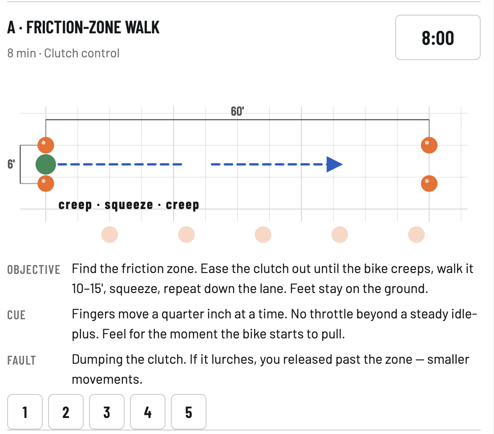

# MC Trainer — free motorcycle skills training for your phone

A free motorcycle skills trainer for your phone. Empty parking lot, a bag of mini cones, 20 minutes a session. Sixteen drills, an eight-cycle program that gets progressively harder, and the pre-ride checklists every rider should know cold.

No ads, no accounts, no tracking, no backend. One HTML file that runs offline from your Home Screen. Progress stays on your phone.

**Why it exists.** Most riders take one course and then never practice the skills that save lives: quick stops, swerves, stopping in a curve, slow-speed control. This app makes practicing those skills easy enough that you actually do it.

## Credit where it's due

The drills follow the skill families taught in the **Motorcycle Safety Foundation** Basic RiderCourse: friction zone, slow-speed control, shifting, braking, cornering, swerving, and limited-space maneuvers. MSF's curriculum is the reference for rider training in the United States, and the single best thing you can do for your riding is take their course: [msf-usa.org](https://msf-usa.org).

MC Trainer is an independent project. It is **not affiliated with, endorsed by, or a substitute for** the Motorcycle Safety Foundation or its courses, and it reproduces none of MSF's materials, range cards, or text. Take the course first; use this to stay sharp afterward.

## Ride at your own risk

Motorcycling is dangerous and practice drills carry real risk. Practice only where you have permission and no traffic, in full protective gear, at speeds you control. Every dimension in the app is a starting point: check it against your bike, your lot, and your skill, and adjust. You are responsible for your own safety. This software is provided as-is, without warranty of any kind (see LICENSE).

## Put it on your phone

1. Open **https://alfaholic.github.io/mc-trainer/** in Safari on an iPhone (or Chrome on Android).
2. Share → **Add to Home Screen**.
3. Open it once from the Home Screen while online. After that it works with no signal.

## What's inside

- **Today** — the session: pre-ride checklists (T-CLOCS, gear, FINE-C), the cone layout with dimensions, two drills with diagrams and timers, cool-down, and a 1–5 self-rating.
- **Cycle** — the eight-cycle plan. Each cycle has a strategic goal, three core sessions and two bonus sessions, and advances when the three core sessions are done, not on a calendar.
- **Drills** — all sixteen drills plus the skills lap, each with a to-scale diagram, objective, cue, and common fault.
- **Ref** — the acronyms explained, a Standard/Large bike-size setting, and this credit.

**Progression.** Every cycle has a level (1–3). The lane narrows, the stop zone shrinks, the weave tightens, the box narrows, and target speeds rise. The Large setting widens the lane and box for full-size cruisers and tourers.

**One cone layout.** All seventeen cones are set once at the start of a session and never move mid-session. Riding time, not cone-moving time.

## Editing the program

Everything is in `index.html`. `DRILLS` holds every drill, `PLAN` holds the eight cycles, `range()` holds cone positions and the level progression, `CHECKS` holds the checklists. Change it, save, reload. To ship an update to an installed phone, change `mct-v2` in `sw.js` to `mct-v3`.

## Progress backup

Cycle → **Export progress** copies your progress as text. Paste it into **Import** on a new phone.

## License

MIT. Fork it, improve it, share it. If it helps one rider stop shorter, it did its job.
